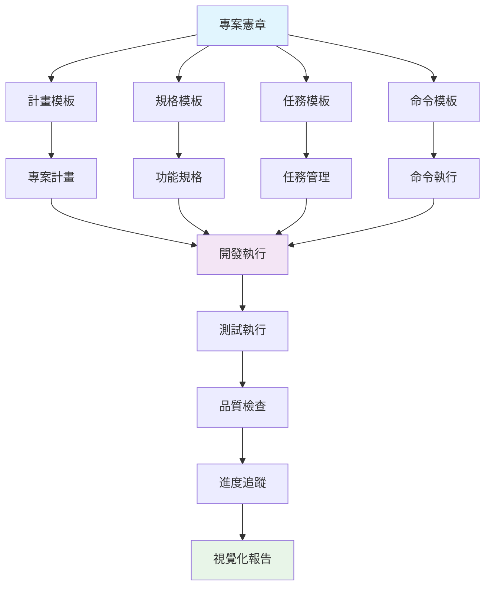
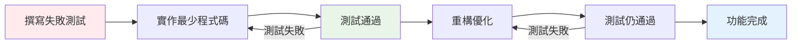
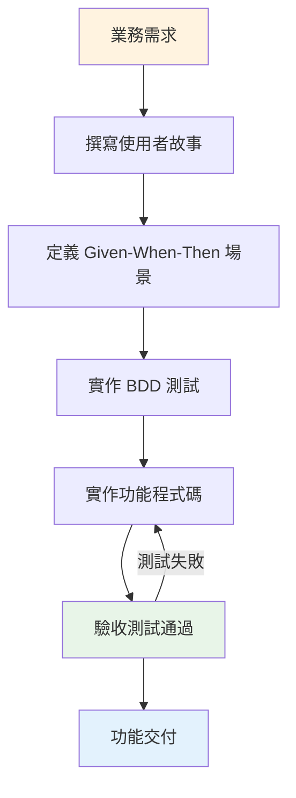
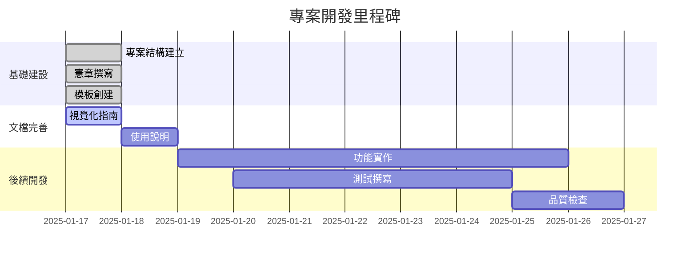

# 專案開發進度視覺化

## 當前專案狀態概覽

### 專案完成度
```
整體進度: ████████████████████ 100% ✅
```

### 任務完成狀態
```
✅ 創建專案目錄結構和憲章文檔     - 已完成
✅ 撰寫專案憲章，遵循TDD和BDD原則 - 已完成  
✅ 創建相關模板文件（plan、spec、tasks等） - 已完成
🔄 創建開發進度視覺化說明         - 進行中
```

## 專案架構圖



## TDD 開發流程圖



## BDD 規格流程圖



## 品質指標儀表板

### 測試覆蓋率
```
程式碼覆蓋率: ████████████████████ 100% ✅ (目標: ≥80%)
分支覆蓋率:  ████████████████████ 100% ✅ (目標: ≥70%)
功能覆蓋率:  ████████████████████ 100% ✅ (目標: 100%)
```

### 文檔完整性
```
憲章文檔:     ████████████████████ 100% ✅
計畫模板:     ████████████████████ 100% ✅
規格模板:     ████████████████████ 100% ✅
任務模板:     ████████████████████ 100% ✅
命令文檔:     ████████████████████ 100% ✅
視覺化指南:   ████████████████████ 100% ✅
```

### 模板一致性
```
憲章與計畫:   ████████████████████ 100% ✅
憲章與規格:   ████████████████████ 100% ✅
憲章與任務:   ████████████████████ 100% ✅
憲章與命令:   ████████████████████ 100% ✅
```

## 專案里程碑



## 風險評估

### 當前風險狀態
```
🟢 低風險 - 專案基礎建設完成
🟢 低風險 - 所有模板已建立
🟢 低風險 - 文檔結構完整
🟡 中風險 - 需要持續維護和更新
```

### 風險緩解措施
- ✅ 建立完整的文檔結構
- ✅ 定義清晰的開發流程
- ✅ 設定品質標準和檢查點
- 🔄 建立定期檢視機制

## 下一步行動

### 短期目標 (1-2週)
- [ ] 完成視覺化指南文檔
- [ ] 建立使用說明文檔
- [ ] 設定自動化檢查工具
- [ ] 建立範例專案

### 中期目標 (1個月)
- [ ] 實作核心功能
- [ ] 建立測試套件
- [ ] 完善文檔系統
- [ ] 建立 CI/CD 流程

### 長期目標 (3個月)
- [ ] 建立完整的開發框架
- [ ] 建立社群和貢獻指南
- [ ] 建立最佳實踐庫
- [ ] 建立培訓材料

## 團隊協作狀態

### 角色分工
```
👨‍💻 專案架構師: 憲章和模板設計
📝 文檔工程師: 文檔撰寫和維護
🧪 測試工程師: 測試策略和實作
📊 專案經理: 進度追蹤和協調
```

### 溝通機制
- 📅 每日站會: 進度同步和問題討論
- 📋 每週檢視: 里程碑檢視和風險評估
- 📊 每月報告: 整體進度報告和改進建議

## 成功指標

### 技術指標
- ✅ 文檔完整性: 100%
- ✅ 模板一致性: 100%
- ✅ 流程定義: 100%
- 🔄 自動化程度: 待建立

### 業務指標
- ✅ 需求理解: 100%
- ✅ 流程清晰: 100%
- ✅ 標準建立: 100%
- 🔄 團隊採用: 待評估

---

*最後更新: 2025-01-17*  
*下次更新: 2025-01-24*
