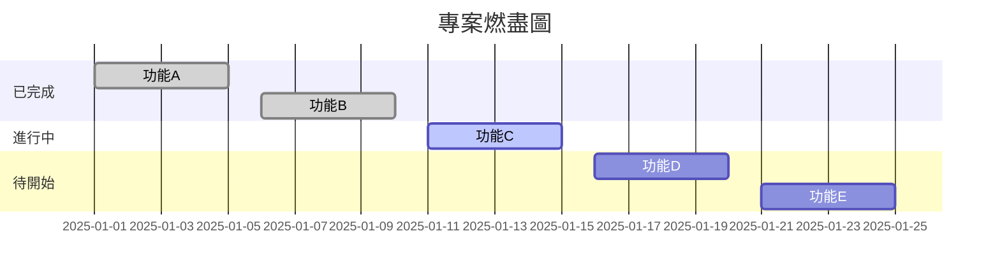
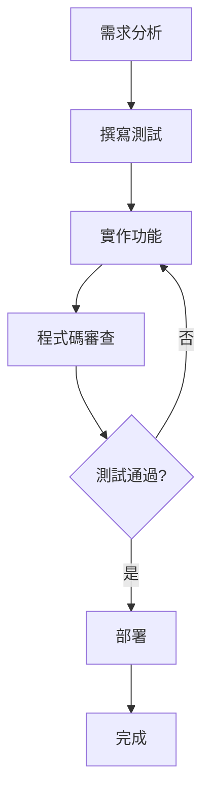

# 開發進度視覺化指南

## 概述

本指南說明如何建立和維護專案開發進度的視覺化報告，遵循專案憲章中的視覺化進度追蹤原則。

## 視覺化類型

### 1. 燃盡圖 (Burndown Chart)

#### 用途
追蹤剩餘工作量隨時間的變化，預測專案完成時間。

#### 資料來源
- 任務工時估算
- 實際完成工時
- 每日進度更新

#### 更新頻率
- 每日更新
- 每週檢視趨勢

#### 範例格式


### 2. 測試覆蓋率趨勢圖

#### 用途
監控程式碼測試覆蓋率的變化趨勢，確保品質標準。

#### 資料來源
- 單元測試覆蓋率
- 整合測試覆蓋率
- 端對端測試覆蓋率

#### 更新頻率
- 每次程式碼提交
- 每週趨勢分析

#### 目標指標
- 程式碼覆蓋率: ≥ 80%
- 分支覆蓋率: ≥ 70%
- 功能覆蓋率: 100%

### 3. 程式碼品質指標

#### 用途
追蹤程式碼品質的改善情況，識別技術債務。

#### 監控指標
- 程式碼複雜度
- 靜態分析分數
- 技術債務比率
- 程式碼重複率

#### 更新頻率
- 每日自動檢查
- 每週品質報告

### 4. 功能完成度儀表板

#### 用途
提供專案整體進度的概覽，識別風險和瓶頸。

#### 組成元素
- 里程碑進度
- 功能完成百分比
- 測試通過率
- 部署狀態

#### 更新頻率
- 每週更新
- 里程碑檢視時更新

## 視覺化工具

### 1. Mermaid 圖表

#### 優點
- 文字描述生成圖表
- 版本控制友好
- 易於維護和更新

#### 適用場景
- 流程圖
- 甘特圖
- 狀態圖
- 類別圖

#### 範例


### 2. 進度條

#### 用途
直觀顯示任務或功能的完成進度。

#### 格式
```
功能A: ████████████████████ 100% ✅
功能B: ████████████████░░░░  80% 🔄
功能C: ████████░░░░░░░░░░░░  40% ⏳
功能D: ░░░░░░░░░░░░░░░░░░░░   0% 📋
```

### 3. 狀態指示器

#### 用途
快速識別專案各組件的狀態。

#### 狀態類型
- 🟢 正常 (Green)
- 🟡 警告 (Yellow)
- 🔴 錯誤 (Red)
- 🔵 進行中 (Blue)
- ⚪ 待處理 (Gray)

## 報告模板

### 週報模板

```markdown
# 專案進度週報 - 第 [X] 週

## 📊 整體進度
- 專案完成度: [X]%
- 本週完成任務: [X] 個
- 剩餘任務: [X] 個

## 🎯 里程碑狀態
| 里程碑 | 進度 | 狀態 | 預估完成 |
|--------|------|------|----------|
| M1 | [X]% | 🟢 | [日期] |
| M2 | [X]% | 🟡 | [日期] |
| M3 | [X]% | 🔴 | [日期] |

## 🧪 測試覆蓋率
- 程式碼覆蓋率: [X]% (目標: 80%)
- 分支覆蓋率: [X]% (目標: 70%)
- 功能覆蓋率: [X]% (目標: 100%)

## 📈 品質指標
- 程式碼複雜度: [X] (目標: ≤10)
- 靜態分析分數: [X] (目標: ≥8)
- 技術債務比率: [X]% (目標: ≤5%)

## 🚨 風險與問題
- [風險1]: [描述] - [緩解措施]
- [風險2]: [描述] - [緩解措施]

## 📋 下週計畫
- [ ] [任務1]
- [ ] [任務2]
- [ ] [任務3]
```

### 月報模板

```markdown
# 專案進度月報 - [月份] [年份]

## 📊 月度總結
- 完成功能: [X] 個
- 新增測試: [X] 個
- 程式碼行數: [X] 行
- 修復缺陷: [X] 個

## 🎯 里程碑達成
- ✅ [已完成的里程碑]
- 🔄 [進行中的里程碑]
- ⏳ [待開始的里程碑]

## 📈 趨勢分析
### 測試覆蓋率趨勢
[插入圖表]

### 程式碼品質趨勢
[插入圖表]

### 功能完成度趨勢
[插入圖表]

## 🏆 成就與改進
### 本月成就
- [成就1]
- [成就2]
- [成就3]

### 改進建議
- [改進建議1]
- [改進建議2]
- [改進建議3]

## 📋 下月重點
- [重點1]
- [重點2]
- [重點3]
```

## 自動化工具

### 1. CI/CD 整合

#### 自動產生指標
- 測試覆蓋率報告
- 程式碼品質分析
- 建置狀態通知
- 部署狀態追蹤

#### 工具選擇
- GitHub Actions
- Jenkins
- GitLab CI
- Azure DevOps

### 2. 監控儀表板

#### 即時監控
- 系統效能指標
- 錯誤率監控
- 使用者活動追蹤
- 業務指標監控

#### 工具選擇
- Grafana
- Kibana
- DataDog
- New Relic

## 最佳實踐

### 1. 資料準確性
- 確保資料來源可靠
- 定期驗證指標計算
- 建立資料品質檢查
- 記錄資料更新時間

### 2. 視覺化設計
- 使用一致的顏色方案
- 保持圖表簡潔明瞭
- 提供適當的上下文說明
- 考慮不同受眾需求

### 3. 更新頻率
- 根據專案階段調整頻率
- 重要指標即時更新
- 定期檢視報告有效性
- 根據回饋調整格式

### 4. 團隊協作
- 確保所有成員了解指標含義
- 定期討論進度和問題
- 鼓勵主動回饋和建議
- 建立持續改進文化

## 故障排除

### 常見問題

#### 1. 資料不一致
**問題**: 不同來源的資料顯示不一致
**解決方案**: 
- 統一資料來源
- 建立資料同步機制
- 定期資料驗證

#### 2. 圖表載入緩慢
**問題**: 大量資料導致圖表載入緩慢
**解決方案**:
- 資料分頁或篩選
- 快取機制
- 非同步載入

#### 3. 指標解讀困難
**問題**: 團隊成員不理解指標含義
**解決方案**:
- 提供指標說明文檔
- 定期培訓和說明
- 簡化指標設計

## 相關資源

### 文檔連結
- [專案憲章](../.specify/memory/constitution.md)
- [計畫模板](../.specify/templates/plan-template.md)
- [規格模板](../.specify/templates/spec-template.md)
- [任務模板](../.specify/templates/tasks-template.md)

### 工具文檔
- [Mermaid 語法指南](https://mermaid-js.github.io/mermaid/)
- [GitHub Actions 文檔](https://docs.github.com/en/actions)
- [Grafana 使用指南](https://grafana.com/docs/)

### 最佳實踐參考
- [敏捷開發視覺化](https://www.agilealliance.org/)
- [DevOps 指標指南](https://devops.com/)
- [軟體品質度量](https://www.sqma.org/)
